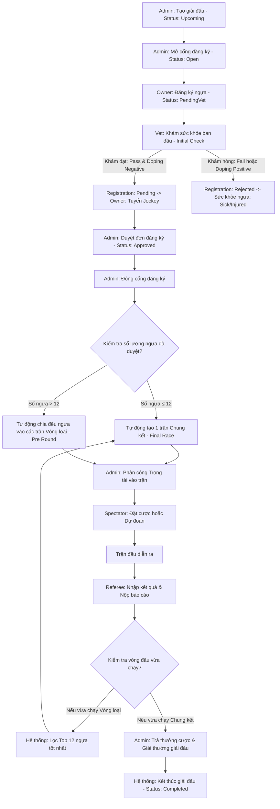

# 🏆 KỊCH BẢN CHÍNH: VÒNG ĐỜI GIẢI ĐẤU (MASTER TOURNAMENT LIFECYCLE)

Bản kịch bản này điều phối và dẫn dắt toàn bộ buổi demo từ lúc khởi tạo giải đấu cho đến khi hoàn tất và phân bổ giải thưởng tài chính.

---

## 🗺️ BẢN ĐỒ TIẾN TRÌNH DEMO (ROADMAP)

---

## 🛠️ HƯỚNG DẪN TỪNG BƯỚC (STEP-BY-STEP DEMO GUIDE)

### BƯỚC 1: TẠO VÀ MỞ GIẢI ĐẤU
1. **Actor**: `Admin`
2. **Hành động**: Gọi API/Giao diện để tạo giải đấu (`Tournament`) mới.
   * Trạng thái ban đầu: `Upcoming`.
3. **Cấu hình bắt buộc**:
   * Thiết lập `RegistrationStartDate` và `RegistrationEndDate` để mở đăng ký.
   * Thiết lập `StartDate` và `EndDate` cho khoảng thời gian diễn ra các trận đua.
4. **Trực quan hóa**:
   * Khi thời gian thực tế chạm `RegistrationStartDate` (hoặc cấu hình thủ công), trạng thái giải đấu chuyển thành `Registration Open`.

### BƯỚC 2: ĐĂNG KÝ THAM GIA & MỜI JOCKEY
1. **Actor**: `Horse Owner` & `Jockey`
2. **Hành động**:
   * Chủ ngựa thực hiện đăng ký ngựa (Xem tại [01-subflow-horse-registration.md](file:///e:/_SU26/SWP391/HorseManagementSystem/HorseRacingManagementSystem/.antigravity/scripts/01-subflow-horse-registration.md)).
   * **Mời Jockey (Tuyển nài ngựa):** Chủ ngựa **chỉ có thể** gửi lời mời hợp đồng (`Jockey Contract Invitation`) cho Jockey sau khi ngựa đã vượt qua kiểm tra y tế ban đầu (Initial Medical Check) với kết quả là `Pass` (Trạng thái đơn đăng ký chuyển sang `Pending`). Xem chi tiết tại [02-subflow-jockey-invitation.md](file:///e:/_SU26/SWP391/HorseManagementSystem/HorseRacingManagementSystem/.antigravity/scripts/02-subflow-jockey-invitation.md).
3. **Trực quan hóa**:
   * Một dòng đăng ký mới (`Registration`) được tạo ở trạng thái ban đầu là **`PendingVet`**.
   * Sau khi ngựa khám sức khỏe đạt (`Pass`), trạng thái đơn đăng ký chuyển sang **`Pending`**. Lúc này, Chủ ngựa tiến hành gửi lời mời hợp đồng cho Jockey. Khi Jockey chấp nhận, hợp đồng chuyển sang trạng thái `Accepted` hoặc `Active`.
   * **Ràng buộc khi kết thúc thời gian đăng ký:** Khi cổng đăng ký giải đấu đóng lại, hệ thống sẽ tự động hủy (`Auto-cancel` sang trạng thái `Cancelled`) toàn bộ đơn đăng ký nào vẫn chưa có nài ngựa chấp nhận hợp đồng (`Accepted`/`Active`).

### BƯỚC 3: KIỂM TRA Y TẾ BAN ĐẦU & DUYỆT ĐĂNG KÝ
1. **Actor**: `Veterinarian` & `Admin`
2. **Hành động**:
   * Bác sĩ thú y gọi API khám sức khỏe ban đầu cho những con ngựa đăng ký (`Initial Check`).
   * Nhập kết quả khám thực tế: Cân nặng, Nhịp tim, Nhiệt độ và Doping.
3. **Điều kiện quyết định và kết quả**:
   * **Nếu khám ĐẠT (`Pass` & `Negative` Doping)**:
     * Các thông số kiểm tra phải nằm trong giới hạn an toàn bắt buộc: Cân nặng **`300 – 700 kg`**, Nhịp tim **`28 – 44 bpm`**, Nhiệt độ **`37.2 – 38.3 °C`** và Doping **`Negative`**.
     * Trạng thái đơn đăng ký chuyển từ `PendingVet` sang **`Pending`** (Sẵn sàng tuyển Jockey và chờ Admin duyệt).
     * Tình trạng sức khỏe ngựa (Health Status) tự động cập nhật là **`Healthy`**.
     * Admin có thể duyệt (`Approve`) đơn đăng ký của ngựa sang trạng thái **`Approved`** từ menu Admin (hệ thống cho phép duyệt khi đơn ở trạng thái `Pending` mà không cần kiểm tra Jockey ngay lập tức, tuy nhiên nếu thiếu Jockey khi đăng ký đóng, đơn sẽ bị hủy tự động).
   * **Nếu khám KHÔNG ĐẠT (`Fail` hoặc `Positive` Doping)**:
     * Đơn đăng ký tự động chuyển sang trạng thái **`Rejected`** (Bị loại khỏi giải).
     * Tình trạng sức khỏe ngựa (Health Status) cập nhật thành **`Sick`** (nếu Doping dương tính) hoặc **`Injured`** (nếu Doping âm tính/lý do khác). Bác sĩ thú y bắt buộc phải nhập lý do thất bại (`FailReason`).

### BƯỚC 4: TỰ ĐỘNG CHIA BẢNG ĐUA & PHÂN CÔNG TRỌNG TÀI
1. **Actor**: `Admin` (hoặc Hệ thống tự động kích hoạt)
2. **Hành động**: Gọi chức năng đóng đăng ký giải đấu và tiến hành chia bảng.
3. **Quy tắc chia bảng thực tế trong Code**:
   * **Nếu số ngựa hợp lệ ≤ 12**:
     * Hệ thống tự động tạo **1 lượt đua Chung kết (Final Race)** duy nhất.
     * Toàn bộ ngựa được đưa vào các làn (`LaneNo`) của Race này.
   * **Nếu số ngựa hợp lệ > 12**:
     * Hệ thống tự động chia đều số ngựa vào các lượt đua **Vòng loại (Pre Round)**. Mỗi lượt đua có tối đa 12 làn.
     * Ví dụ: 13 ngựa sẽ chia làm 2 Race (7 ngựa và 6 ngựa); 24 ngựa chia làm 2 Race (12 ngựa và 12 ngựa).
4. **Phân công trọng tài**:
   * Admin phân công trọng tài vào từng Race (`RaceRefereeAssignment`). Chỉ những trọng tài được phân công (`Active`) mới có quyền tương tác với trận đấu đó.

### BƯỚC 5: ĐẶT CƯỢC & DỰ ĐOÁN
1. **Actor**: `Spectator`
2. **Hành động**: Nạp tiền và thực hiện đặt cược/dự đoán (Xem tại [03-subflow-spectator-betting.md](file:///d:/SU26_semeter5/SWP/HorseRacingManagementSystem/.antigravity/scripts/03-subflow-spectator-betting.md)).
3. **Điều kiện**: Lượt đua bắt buộc phải ở trạng thái `Scheduled`.

### BƯỚC 6: CHẠY ĐUA & NỘP KẾT QUẢ
1. **Actor**: `Referee` & `Veterinarian`
2. **Hành động**:
   * Giám sát vi phạm và cập nhật sức khỏe khẩn cấp nếu có sự cố (Xem tại [04-subflow-referee-and-violation.md](file:///d:/SU26_semeter5/SWP/HorseRacingManagementSystem/.antigravity/scripts/04-subflow-referee-and-violation.md)).
   * Trọng tài nộp kết quả đua (`FinishTime`, `FinishPosition`) và báo cáo tổng hợp.

### BƯỚC 7: TẠO CHUNG KẾT (NẾU CÓ VÒNG LOẠI)
1. **Actor**: `Admin` / Hệ thống
2. **Điều kiện kích hoạt**: Chỉ khi giải đấu có chia bảng Vòng loại (Pre Round) và tất cả các trận Pre Round đã hoàn thành.
3. **Hành động**:
   * Hệ thống tự động quét kết quả của tất cả các trận Pre Round.
   * Thực hiện sắp xếp để chọn ra **Top 12 ngựa xuất sắc nhất** dựa trên:
     1. Thời gian về đích nhanh nhất (`FinishTime` tăng dần).
     2. Thứ hạng về đích tốt nhất (`FinishPosition` tăng dần).
     3. Thời gian trung bình tốt nhất (`AverageTime` tăng dần).
   * Tạo **1 trận Chung kết (Final Race)** chứa 12 con ngựa này.
   * Lặp lại quy trình **Đặt cược (Bước 5)** và **Chạy đua (Bước 6)** cho trận Chung kết này.

### BƯỚC 8: TRẢ CƯỢC & PHÂN BỔ GIẢI THƯỞNG
1. **Actor**: `Admin` / Hệ thống
2. **Hành động**:
   * **Trả cược (Bet Payout)**: Gọi API trigger trả thưởng cược cho lượt đua. Hệ thống tự động tính tiền thắng dựa trên odds và cộng trực tiếp vào ví của Spectator.
   * **Chia thưởng giải đấu (Prize Payout)**: Sau khi trận Chung kết hoàn tất, Admin duyệt phát thưởng giải đấu. Tiền thưởng giải đấu được chuyển trực tiếp vào ví của Chủ ngựa và Jockey theo đúng tỷ lệ phần trăm đã ký kết trong hợp đồng Jockey trước đó.
3. **Kết thúc**: Trạng thái giải đấu chuyển thành `Completed`.
