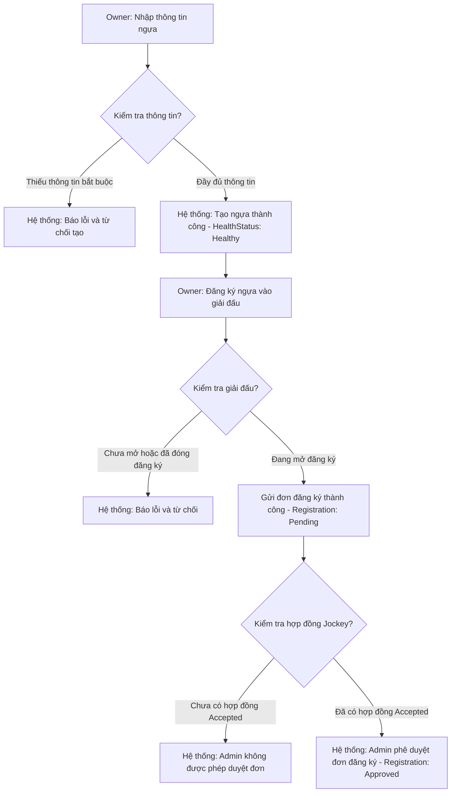

# 🐴 PHÂN LUỒNG CHI TIẾT: ĐĂNG KÝ NGỰA (HORSE REGISTRATION)

Kịch bản này mô tả chi tiết quy trình đăng ký ngựa mới vào hệ thống và đăng ký ngựa tham gia giải đấu cụ thể.

---

## 🗺️ SƠ ĐỒ ĐIỀU KIỆN ĐĂNG KÝ (CONDITIONAL DIAGRAM)

---

## 📋 CÁC ĐIỀU KIỆN & RÀNG BUỘC NGHIỆP VỤ (BUSINESS RULES)

### 1. QUYỀN SỞ HỮU & CẬP NHẬT THÔNG TIN
* **Chủ sở hữu**: Chỉ người dùng có vai trò `HorseOwner` và có ID trùng với `OwnerId` của ngựa mới có quyền thực hiện các thao tác:
  * Thêm/sửa đổi thông tin ngựa.
  * Tải lên tài liệu chứng minh nguồn gốc (`HorseDocument`).
  * Gửi yêu cầu đăng ký giải đấu.
* **API Kiểm tra**:
  * Tạo ngựa: `POST /api/horses`
  * Sửa ngựa: `PUT /api/horses/{id}`
  * Xóa ngựa: `DELETE /api/horses/{id}` (Không cho xóa nếu ngựa đang có đăng ký giải đấu hoạt động).

### 2. TRẠNG THÁI SỨC KHỎE MẶC ĐỊNH
* Khi ngựa được tạo mới, trạng thái sức khỏe mặc định (`HealthStatus`) luôn là `Healthy`.
* Trạng thái này có thể bị thay đổi sau đó bởi **Bác sĩ thú y (Veterinarian)** thông qua khám sức khỏe hoặc tái khám.

### 3. THỜI GIAN ĐĂNG KÝ GIẢI ĐẤU
* Yêu cầu đăng ký giải đấu (`CreateRegistrationRequest`) chỉ được chấp nhận nếu thời gian thực tế nằm trong khoảng:
  `Tournament.RegistrationStartDate` <= Hiện tại <= `Tournament.RegistrationEndDate`.

### 4. ĐIỀU KIỆN PHÊ DUYỆT ĐĂNG KÝ (RÀNG BUỘC CỨNG CỦA ADMIN)
* Admin duyệt đăng ký qua API: `PUT /api/registrations/{id}/status`.
* Hệ thống sẽ **từ chối phê duyệt** và báo lỗi nếu:
  * Không tìm thấy hợp đồng Jockey (`JockeyContract`) tương ứng với con ngựa này tại giải đấu này.
  * Hợp đồng Jockey tồn tại nhưng trạng thái **chưa được đồng ý** (Status khác `Accepted`).
