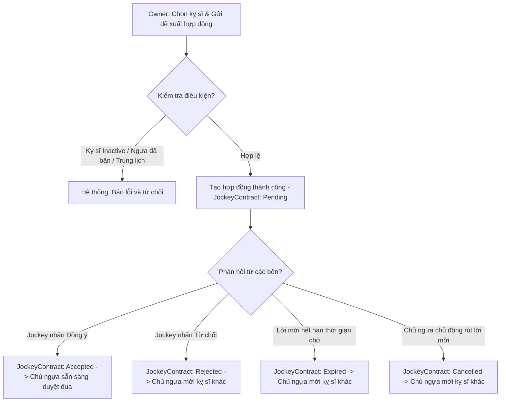

# 🏇 PHÂN LUỒNG CHI TIẾT: ĐỀ XUẤT HỢP ĐỒNG KỴ SĨ (JOCKEY CONTRACT INVITATION)

Kịch bản này mô tả chi tiết quy trình gửi đề xuất hợp đồng của Chủ ngựa và 4 hướng phản hồi/xử lý hợp đồng trong giải đấu.

---

## 🗺️ SƠ ĐỒ ĐIỀU KIỆN LỜI MỜI (CONDITIONAL DIAGRAM)

---

## 📋 CÁC ĐIỀU KIỆN & RÀNG BUỘC NGHIỆP VỤ (BUSINESS RULES)

### 1. KIỂM TRA TRẠNG THÁI TÀI KHOẢN JOCKEY
* API: `POST /api/jockey-contracts`
* Chỉ được gửi lời mời đến tài khoản có `Role = "Jockey"` và `Status = "Active"`.

### 2. QUY TẮC ĐỘC QUYỀN (RÀNG BUỘC PHÂN CÔNG GIẢI ĐẤU)
* **Đối với Jockey**: Một Jockey không được phép ký hợp đồng đua (`Accepted` hoặc `Active`) cho **nhiều hơn 1 con ngựa trong cùng 1 giải đấu**.
  * API check busy: `GET /api/jockeys/{jockeyId}/check-busy/{tournamentId}`
* **Đối với Ngựa**: Một con ngựa không được phép có nhiều hơn 1 hợp đồng ở trạng thái hoạt động (`Pending`, `Accepted`, hoặc `Active`) tại cùng một giải đấu.
  * API check busy: `GET /api/horses/{horseId}/check-busy/{tournamentId}`

### 3. THỜI GIAN HỢP ĐỒNG (DATE VALIDATIONS)
* Ngày bắt đầu hợp đồng phải trước ngày kết thúc (`StartDate` < `EndDate`).
* Ngày bắt đầu không được ở quá khứ (`StartDate` >= Hiện tại).
* Thời hạn lời mời phải ở tương lai (`InvitationExpiredAt` > Hiện tại).
* Toàn bộ thời gian hợp đồng đua phải nằm trọn trong khoảng thời gian diễn ra giải đấu:
  `Tournament.StartDate` <= `JockeyContract.StartDate` < `JockeyContract.EndDate` <= `Tournament.EndDate`.

### 4. QUẢN LÝ QUÁ HẠN LỜI MỜI (AUTO-EXPIRE)
* Hệ thống sẽ tự động quét thông qua hàm `CheckAndUpdateExpiredContractsAsync()` mỗi khi có yêu cầu lấy danh sách hợp đồng.
* Nếu thời gian hiện tại vượt quá `InvitationExpiredAt` mà trạng thái vẫn là `Pending`, hệ thống tự động chuyển trạng thái thành `Expired` và gửi thông báo cho Chủ ngựa.

### 5. CHỦ NGỰA HỦY LỜI MỜI (CANCEL)
* API: `DELETE /api/jockey-contracts/{id}`
* Chỉ cho phép hủy khi hợp đồng đang ở trạng thái `Pending`. Trạng thái chuyển thành `Cancelled`.
* Gửi thông báo cho Jockey để cập nhật màn hình.
