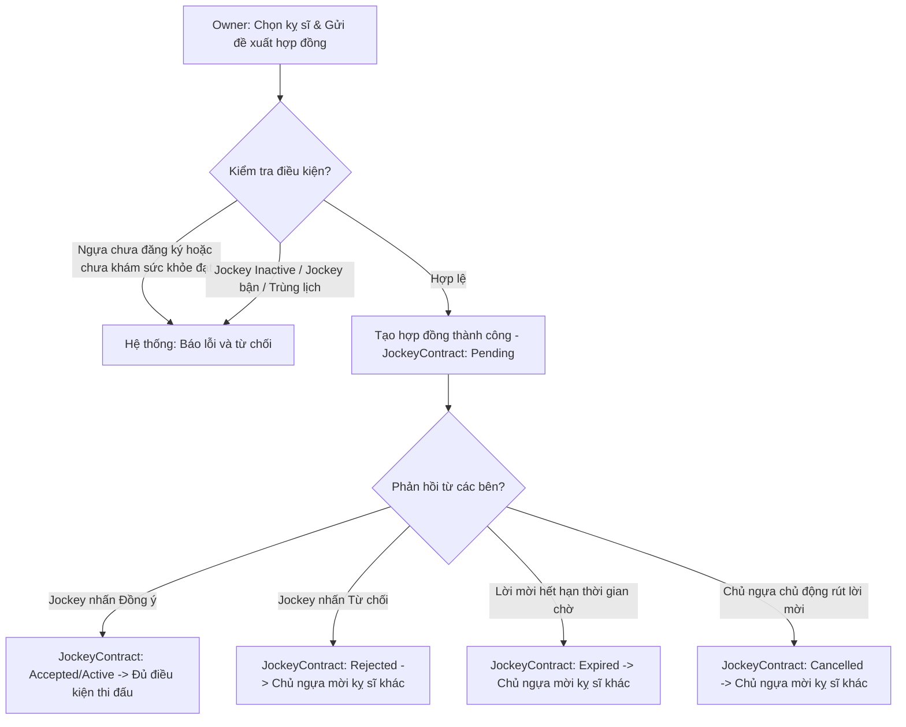

# 🏇 PHÂN LUỒNG CHI TIẾT: ĐỀ XUẤT HỢP ĐỒNG KỴ SĨ (JOCKEY CONTRACT INVITATION)

Kịch bản này mô tả chi tiết quy trình gửi đề xuất hợp đồng của Chủ ngựa và 4 hướng phản hồi/xử lý hợp đồng trong giải đấu.

---

## 🗺️ SƠ ĐỒ ĐIỀU KIỆN LỜI MỜI (CONDITIONAL DIAGRAM)

---

## 📋 CÁC ĐIỀU KIỆN & RÀNG BUỘC NGHIỆP VỤ (BUSINESS RULES)

### 1. ĐIỀU KIỆN TIÊN QUYẾT ĐỐI VỚI NGỰA
* Chủ ngựa **chỉ có thể** gửi lời mời nài ngựa (Jockey Contract) sau khi ngựa đã được đăng ký vào giải đấu (ở trạng thái `Pending` - tức đã qua khám sức khỏe đạt `Pass`). 
* Nếu ngựa chưa có đơn đăng ký giải đấu hoặc chưa có kết quả y tế đạt `Pass` nào ở giải đấu này, hệ thống sẽ báo lỗi và chặn hành động tạo hợp đồng.

### 2. KIỂM TRA TRẠNG THÁI TÀI KHOẢN JOCKEY
* API gửi lời mời: `POST /api/owner/jockey-contracts`
* Chỉ được gửi lời mời đến tài khoản có `Role = "Jockey"` và `Status = "Active"`.

### 3. QUY TẮC ĐỘC QUYỀN (RÀNG BUỘC PHÂN CÔNG GIẢI ĐẤU)
* **Đối với Jockey**: Một Jockey không được phép ký hợp đồng đua (`Accepted` hoặc `Active`) cho **nhiều hơn 1 con ngựa trong cùng 1 giải đấu**.
* **Đối với Ngựa**: Một con ngựa không được phép có nhiều hơn 1 hợp đồng ở trạng thái hoạt động (`Pending`, `Accepted`, hoặc `Active`) tại cùng một giải đấu.

### 4. THỜI GIAN HỢP ĐỒNG (DATE VALIDATIONS)
* Ngày bắt đầu hợp đồng phải trước ngày kết thúc (`StartDate` < `EndDate`).
* Ngày bắt đầu không được ở quá khứ (`StartDate` >= Hiện tại).
* Thời hạn lời mời phải ở tương lai (`InvitationExpiredAt` > Hiện tại).
* Toàn bộ thời gian hợp đồng đua phải nằm trọn trong khoảng thời gian diễn ra giải đấu:
  `Tournament.StartDate` <= `JockeyContract.StartDate` < `JockeyContract.EndDate` <= `Tournament.EndDate`.
* Hạn hết hạn lời mời (`InvitationExpiredAt`) không được thiết lập sau ngày kết thúc đăng ký của giải đấu (`RegistrationEndDate`).

### 5. QUẢN LÝ QUÁ HẠN LỜI MỜI (AUTO-EXPIRE)
* Hệ thống sẽ tự động quét thông qua hàm `CheckAndUpdateExpiredContractsAsync()` mỗi khi có yêu cầu lấy danh sách hợp đồng.
* Nếu thời gian hiện tại vượt quá `InvitationExpiredAt` mà trạng thái vẫn là `Pending`, hệ thống tự động chuyển trạng thái thành `Expired` và gửi thông báo cho Chủ ngựa.

### 6. PHẢN HỒI LỜI MỜI VÀ HỦY LỜI MỜI
* **Jockey phản hồi**: Chấp nhận hoặc từ chối lời mời qua API `PUT /api/jockey/contracts/{id}/respond`. Trạng thái chuyển thành `Accepted`/`Active` hoặc `Rejected`.
* **Chủ ngựa hủy lời mời**: API `DELETE /api/owner/jockey-contracts/{id}`. Chỉ cho phép hủy khi hợp đồng đang ở trạng thái `Pending`. Trạng thái chuyển thành `Cancelled`.
* **Tự động hủy khi đóng đăng ký giải đấu**: Khi cổng đăng ký giải đấu đóng lại, các đơn đăng ký chưa có nài ngựa chấp nhận hợp đồng (`Accepted` hoặc `Active`) sẽ bị hệ thống tự động chuyển sang trạng thái `Cancelled`, đồng thời các lời mời Jockey còn đang chờ phản hồi (`Pending`) của ngựa đó cũng tự động bị hủy (`Cancelled`).
