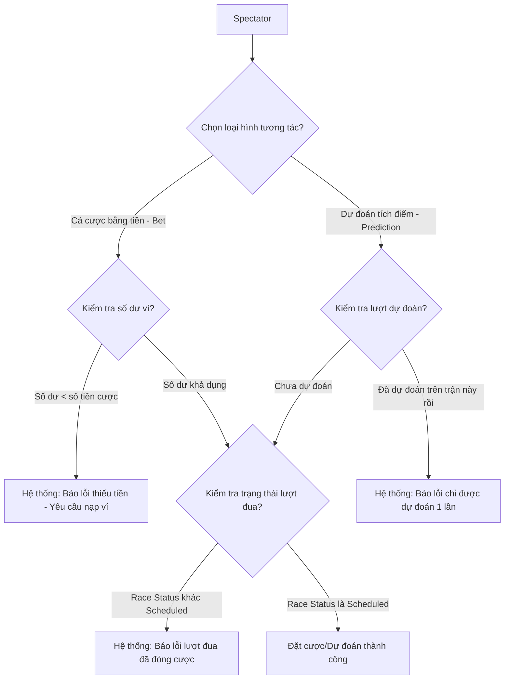

# 💸 PHÂN LUỒNG CHI TIẾT: NẠP TIỀN & ĐẶT CƯỢC (SPECTATOR WALLET & BETTING)

Kịch bản này mô tả chi tiết quy trình quản lý ví tài chính, đặt cược (Betting) bằng tiền, và dự đoán (Prediction) tích lũy điểm của Người xem.

---

## 🗺️ SƠ ĐỒ ĐIỀU KIỆN ĐẶT CƯỢC (CONDITIONAL DIAGRAM)

---

## 📋 CÁC ĐIỀU KIỆN & RÀNG BUỘC NGHIỆP VỤ (BUSINESS RULES)

### 1. QUẢN LÝ VÍ TÀI CHÍNH
* **Tài khoản ví**: Mỗi người dùng (Spectator / Horse Owner) khi thực hiện nạp tiền (`POST /api/spectator/wallet/deposit`) sẽ được tạo/cập nhật thực thể `Wallet`.
* **Rút tiền**: API rút tiền (`POST /api/spectator/wallet/withdraw`) sẽ kiểm tra số dư khả dụng:
  * Nếu `Balance` < `WithdrawRequest.Amount` ➔ Từ chối giao dịch, báo lỗi số dư không đủ.
  * Mỗi giao dịch nạp/rút đều tạo một bản ghi `WalletTransaction` để lưu lịch sử.

### 2. RÀNG BUỘC KHI ĐẶT CƯỢC (BETTING)
* API: `POST /api/spectator/bets`
* **Số tiền cược**: Bắt buộc phải lớn hơn 0.
* **Số dư ví**: Phải lớn hơn hoặc bằng số tiền đặt cược. Hệ thống tự động trừ tiền trong ví ngay sau khi đặt cược thành công.
* **Trạng thái lượt đua**: Chỉ được phép đặt cược khi:
  * Lượt đua ở trạng thái `Scheduled`.
  * Kết quả lượt đua chưa được công bố.
  * Giải đấu chưa kết thúc.
* Nếu cuộc đua đã chuyển sang `Live`, `InProgress` hoặc `Finished`, API sẽ từ chối đặt cược.

### 3. RÀNG BUỘC KHI DỰ ĐOÁN (PREDICTION)
* API: `POST /api/spectator/predictions`
* **Vai trò**: Chỉ người dùng có vai trò `Spectator` mới được phép dự đoán để tích lũy điểm thưởng.
* **Trạng thái lượt đua**: Chỉ cho phép khi lượt đua đang ở trạng thái `Scheduled`.
* **Giới hạn số lượng**: Mỗi người xem chỉ được phép tạo tối đa **1 dự đoán duy nhất** cho mỗi lượt đua (`RaceId`). Nếu gửi yêu cầu lần thứ 2, hệ thống sẽ báo lỗi trùng lặp.
