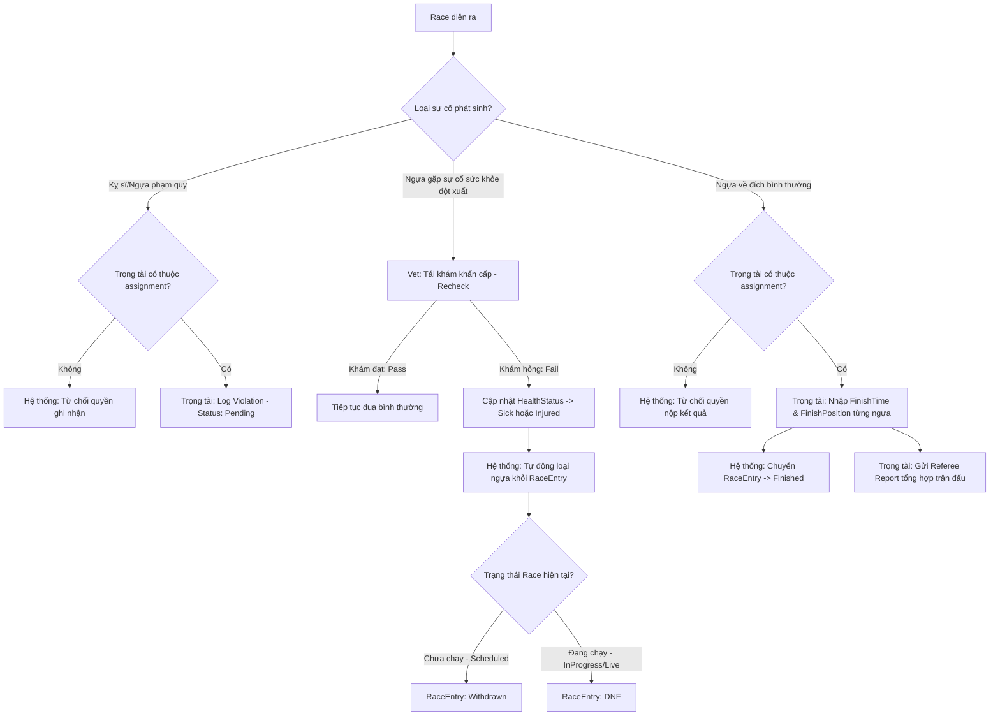

# 🏁 PHÂN LUỒNG CHI TIẾT: TRỌNG TÀI & VI PHẠM (REFEREE OFFICIATING & MEDICAL RECHECK)

Kịch bản này mô tả chi tiết quyền hạn của Trọng tài trong lượt đua, cách ghi nhận vi phạm, nộp kết quả, nộp báo cáo và quy trình Bác sĩ thú y tái khám khẩn cấp để rút ngựa khỏi giải đấu.

---

## 🗺️ SƠ ĐỒ ĐIỀU KIỆN TRỌNG TÀI & Y TẾ (CONDITIONAL DIAGRAM)

---

## 📋 CÁC ĐIỀU KIỆN & RÀNG BUỘC NGHIỆP VỤ (BUSINESS RULES)

### 1. QUYỀN HẠN CỦA TRỌNG TÀI (REFEREE CONSTRAINTS)
* **Phân công bắt buộc**: Một Trọng tài chỉ có quyền thao tác trên một lượt đua (`Race`) nếu có bản ghi phân công tương ứng trong `RaceRefereeAssignment` với trạng thái `Active`.
* **API thực thi**:
  * Log vi phạm: `POST /api/referee/violations`
  * Nộp kết quả: `POST /api/referee/races/{raceId}/results`
  * Nộp báo cáo: `POST /api/referee/reports`
* Nếu tài khoản Referee đang đăng nhập không nằm trong danh sách phân công của lượt đua đó, toàn bộ các API trên sẽ trả về lỗi `Forbid` hoặc `BadRequest`.

### 2. QUY TRÌNH LOẠI NGỰA KHẨN CẤP (VETERINARIAN RECHECK & WITHDRAWAL)
* API tái khám: `POST /api/MedicalCheck/recheck` (Chỉ dành cho kịch bản khẩn cấp trước/trong cuộc đua).
* **Điều kiện bắt buộc để rút ngựa khỏi giải đấu**:
  * Ngựa chỉ được phép chuyển trạng thái lượt đua thành `Withdrawn` hoặc `DNF` khi Bác sĩ thú y đưa ra kết luận khám là `Fail` (Do phát hiện `Sick` - Bị bệnh, hoặc `Injured` - Chấn thương).
  * Không cho phép rút ngựa khi trạng thái sức khỏe đang bình thường (`Healthy`).
* **Hành động tự động của hệ thống khi Recheck Fail**:
  * Cập nhật `HealthStatus` của ngựa thành `Injured`.
  * Chuyển trạng thái đăng ký của ngựa (`Registration.Status`) thành `Disqualified`.
  * Chuyển trạng thái lượt đua (`RaceEntry.Status`):
    * Thành `Withdrawn` (nếu Race chưa bắt đầu).
    * Thành `DNF` (Did Not Finish - nếu Race đang chạy).
  * Gửi thông báo khẩn cấp cho tất cả các bên (Chủ ngựa, Kỵ sĩ, Trọng tài, Người đặt cược).
