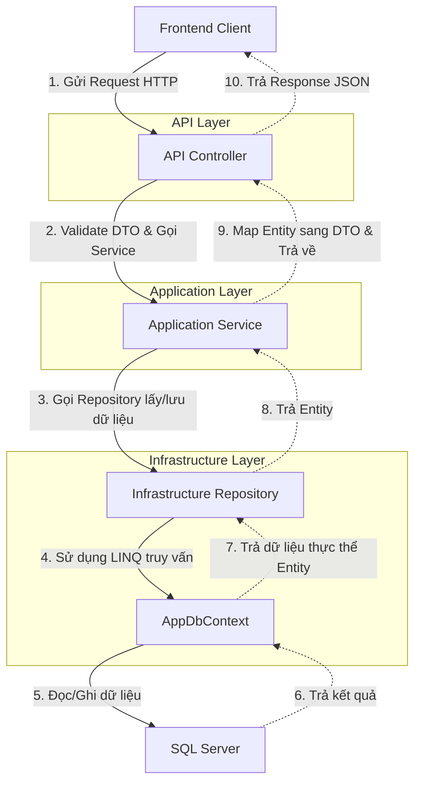

# Backend File Guide - Horse Racing Management System

## 1. Mục đích tài liệu

Tài liệu này được biên soạn nhằm giúp các thành viên trong nhóm phát triển dự án SWP391 hiểu rõ cấu trúc mã nguồn của phần Backend. Tài liệu sẽ giải thích chi tiết vai trò của từng thư mục, các lớp (class) quan trọng hiện có, luồng xử lý yêu cầu (request), cách tiếp cận khi được giao nhiệm vụ mới, các quy ước chung và cách phân chia công việc để tối ưu hóa hiệu năng làm việc nhóm.

---

## 2. Tổng quan kiến trúc backend

Dự án Backend của chúng ta được xây dựng trên nền tảng **ASP.NET Core Web API** với **.NET 8** và sử dụng **Entity Framework Core** để làm việc với hệ quản trị cơ sở dữ liệu **SQL Server**.

Kiến trúc tổng thể của Backend đi theo mô hình **Clean Architecture (Onion Architecture)** chia làm 4 dự án (projects) độc lập tương ứng với các Layer:
* **HorseRacing.Domain (Domain Layer)**: Chứa các thực thể cốt lõi (Entities), Enums, và các Interface dùng chung. Tầng này là trung tâm của hệ thống và độc lập tuyệt đối (không phụ thuộc vào bất kỳ layer nào khác).
* **HorseRacing.Application (Application Layer)**: Chứa logic nghiệp vụ (Services) và định nghĩa dữ liệu truyền tải (DTOs). Tầng này được tổ chức theo từng nhóm chức năng độc lập (**Feature-based**) và phụ thuộc vào Domain Layer.
* **HorseRacing.Infrastructure (Infrastructure Layer)**: Thực hiện chi tiết việc truy cập cơ sở dữ liệu (Repositories), cấu hình Entity Framework (Persistence) và kết nối với các dịch vụ bên ngoài (External Services như Email, Payment). Tầng này phụ thuộc vào Application và Domain Layer.
* **HorseRacing.API (Presentation Layer - Web API)**: Điểm tiếp nhận request từ Client (Frontend), chứa các Controller để lộ API endpoints, Middleware xử lý lỗi và cấu hình Dependency Injection (Extensions). Tầng này phụ thuộc vào Application và Infrastructure Layer.

---

## 3. Cây thư mục tổng quan

Dưới đây là sơ đồ cấu trúc các thư mục chính của dự án backend:

| Thư mục / Tập tin | Vai trò | Khi nào cần đụng vào |
| :--- | :--- | :--- |
| **src/HorseRacing.API/** | Tiếp nhận request từ Client, cấu hình khởi chạy API, phân quyền và Swagger. | Khi định nghĩa route API mới, cấu hình middleware hoặc cài đặt ban đầu. |
| ├── **Controllers/** | Các Controller chứa API endpoints. | Khi thêm mới hoặc chỉnh sửa API của một Actor. |
| ├── **Extensions/** | Các hàm mở rộng đăng ký DI (Dependency Injection). | Khi cấu hình Swagger hoặc thêm thư viện bên ngoài. |
| ├── **Middlewares/** | Các bộ lọc xử lý request/response (như xử lý lỗi toàn cục). | Khi cần thay đổi cơ chế bắt lỗi hệ thống hoặc kiểm tra bảo mật chung. |
| **src/HorseRacing.Application/** | Xử lý logic nghiệp vụ và trao đổi dữ liệu. | Khi thêm logic nghiệp vụ, tính toán dữ liệu hoặc tạo cấu trúc dữ liệu gửi lên/trả về. |
| ├── **Features/** | Chứa các Module/Chức năng nghiệp vụ. | Khi được giao làm một tính năng nghiệp vụ cụ thể. |
| **src/HorseRacing.Domain/** | Lưu trữ cấu trúc cơ sở dữ liệu và các quy tắc nghiệp vụ cốt lõi. | Khi cần thay đổi cấu trúc bảng, thêm cột dữ liệu hoặc thêm kiểu dữ liệu Enum. |
| ├── **Entities/** | Định nghĩa các lớp ánh xạ trực tiếp với bảng DB. | Khi thiết kế lại database hoặc thêm bảng mới. |
| ├── **Enums/** | Định nghĩa tập hợp các giá trị cố định (Status, Role). | Khi thêm trạng thái mới của Race, Transaction, v.v. |
| ├── **Interfaces/** | Khai báo các giao thức truy cập DB (Repository Interfaces). | Khi cần khai báo các hàm truy vấn DB chung cho thực thể. |
| **src/HorseRacing.Infrastructure/**| Cài đặt kỹ thuật thực tế cho Database và bên thứ ba. | Khi viết code truy vấn SQL (Entity Framework), cấu hình bảng cơ sở dữ liệu hoặc cấu hình email/thanh toán. |
| ├── **Persistence/** | Cấu hình DBContext và dữ liệu mẫu (Seed Data). | Khi thay đổi cấu hình DB hoặc muốn nạp dữ liệu ban đầu cho database. |
| ├── **Repositories/** | Triển khai cụ thể các câu lệnh truy vấn EF Core. | Khi viết logic lấy dữ liệu cụ thể từ CSDL để truyền cho Application. |
| ├── **ExternalServices/** | Triển khai dịch vụ Email, Cổng thanh toán. | Khi cấu hình kết nối cổng thanh toán (VNPAY/PayOS) hay dịch vụ gửi mail. |
| **tests/HorseRacing.Tests/** | Dự án Unit Test và Integration Test. | Khi cần viết các ca kiểm thử để đảm bảo code chạy đúng logic. |
| **docs/** | Thư mục tài liệu của dự án. | Khi cần cập nhật tài liệu thiết kế hoặc hướng dẫn cho team. |

---

## 4. Giải thích từng folder

### 4.1. HorseRacing.API (API Layer)
* **Mục đích**: Cung cấp giao diện HTTP API để Client giao tiếp với hệ thống.
* **Các thư mục con**:
  * `Controllers/`: Chứa các controller phân chia theo đối tượng Actor tác động (Ví dụ: `AdminController` chứa các API chỉ Admin được gọi; `SpectatorController` chứa API cho người xem). Tất cả các file trong này hiện tại **chưa có logic nghiệp vụ** (0 bytes).
  * `Middlewares/`: Chứa bộ lọc xử lý lỗi hệ thống (`ExceptionHandlingMiddleware.cs`).
  * `Extensions/`: Chứa các cấu hình mở rộng về Swagger (`SwaggerExtensions.cs`) và đăng ký Service (`ServiceExtensions.cs`).
* **Đối tượng làm việc**: Tất cả các thành viên trong nhóm khi cần công khai API.
* **Ví dụ nghiệp vụ**: Task "Tạo API đăng nhập cho Jockey" -> Tạo API Endpoint trong `Controllers/PublicController.cs` hoặc `JockeyController.cs`.

### 4.2. HorseRacing.Application (Application Layer)
* **Mục đích**: Chứa toàn bộ nghiệp vụ (Use Cases) của hệ thống được tổ chức theo dạng chức năng (**Feature-based**).
* **Các thư mục con (Features)**:
  * `UserManagement/`: Đăng ký, đăng nhập, quản lý thông tin tài khoản và phân quyền.
  * `HorseManagement/`: Quản lý hồ sơ ngựa đua, hồ sơ sức khỏe và thống kê.
  * `TournamentAndRacing/`: Tạo giải đấu, xếp lịch thi đấu, quản lý vòng đua.
  * `OfficiatingAndResults/`: Ghi nhận kết quả đua, biên bản vi phạm từ trọng tài.
  * `BettingEngine/`: Quản lý tỷ lệ cược, đặt cược, quản lý dự đoán.
  * `FinancialRewards/`: Xử lý nạp tiền, rút tiền, trả thưởng giải đấu và trả thưởng cược.
  * `ContractAndRegistration/`: Ký hợp đồng nài ngựa (Jockey), duyệt đăng ký tham gia giải.
  * `Notifications/`: Hệ thống gửi thông báo.
* **Cấu trúc con của mỗi Feature**:
  * `DTOs/`: Chứa các lớp biểu diễn dữ liệu Request nhận vào và Response trả ra.
  * `Interfaces/`: Khai báo Interface của Repository hoặc Service riêng cho Feature đó.
  * `Services/`: Triển khai mã logic chính để tính toán nghiệp vụ.
* **Đối tượng làm việc**: Developer chính phụ trách logic nghiệp vụ. Tất cả các file logic trong này hiện tại **chưa có logic chính** (0 bytes).
* **Ví dụ nghiệp vụ**: Task "Tính toán tỷ lệ cược tự động dựa trên số ngựa đăng ký" -> Viết code trong `BettingEngine/Services/BettingService.cs`.

### 4.3. HorseRacing.Domain (Domain Layer)
* **Mục đích**: Định nghĩa lõi dữ liệu nghiệp vụ và các quy tắc nghiệp vụ bất biến.
* **Các thư mục con**:
  * `Entities/`: Được chia nhóm theo thực thể liên quan (`Compliance` cho trọng tài/vi phạm, `Equines` cho ngựa, `Financials` cho ví/giao dịch/đặt cược, `Tournaments` cho giải đấu, `Users` cho người dùng). Tất cả các thực thể hiện tại đã được tạo khung skeleton lớp cơ bản để phục vụ biên dịch.
  * `Enums/`: Lưu trữ các hằng số trạng thái (Ví dụ: trạng thái cuộc đua `RaceStatus.cs` gồm Draft, Scheduled, Running, Finished, Cancelled).
  * `Interfaces/`: Chứa các Interface Repository cốt lõi (`IUserRepository.cs`, `IHorseRepository.cs`...).
* **Đối tượng làm việc**: Database designer, Lead dev hoặc Developer khi có thay đổi cấu trúc bảng dữ liệu.
* **Ví dụ nghiệp vụ**: Task "Thêm trường ngày sinh cho nài ngựa" -> Sửa thực thể `JockeyProfile.cs` trong thư mục `Entities/Users/`.

### 4.4. HorseRacing.Infrastructure (Infrastructure Layer)
* **Mục đích**: Triển khai các giải pháp kỹ thuật cụ thể liên quan đến CSDL và dịch vụ ngoài.
* **Các thư mục con**:
  * `Persistence/`: Chứa cấu hình kết nối CSDL và DB Context (`AppDbContext.cs`).
  * `Repositories/`: Chứa các lớp cụ thể thực thi câu lệnh SQL/LINQ để đọc ghi CSDL (ví dụ: `UserRepository.cs` kế thừa `IUserRepository`). Hiện các file trong này **chưa có logic truy xuất dữ liệu** (0 bytes).
  * `ExternalServices/`: Chứa các file kết nối SMTP Mail hoặc API cổng thanh toán.
* **Đối tượng làm việc**: Developer phụ trách kỹ thuật database, tích hợp cổng thanh toán.
* **Ví dụ nghiệp vụ**: Task "Lấy danh sách ngựa đua có số trận thắng nhiều nhất" -> Viết câu lệnh truy vấn LINQ/SQL trong `Repositories/HorseRepository.cs`.

---

## 5. Giải thích từng file/class quan trọng

Dưới đây là thông tin chi tiết về các file cấu hình và lớp cốt lõi của Backend:

| File / Class | Chức năng | Phụ thuộc vào | Được dùng bởi | Khi nào cần sửa |
| :--- | :--- | :--- | :--- | :--- |
| **Program.cs** | File khởi chạy chính của API. Cấu hình middleware, nạp appsettings và thiết lập Pipeline xử lý HTTP. | `API.Extensions`, `Infrastructure`, `Middlewares` | Toàn bộ ứng dụng (khi khởi động) | Khi cần thêm Middleware mới, thay đổi thứ tự gọi Pipeline (ví dụ: Cors, Auth). |
| **AppDbContext.cs** | Quản lý kết nối và ánh xạ thực thể nghiệp vụ (Entities) thành các bảng trong CSDL thông qua EF Core. | Microsoft.EntityFrameworkCore, Các class trong `Domain.Entities` | Các Repositories, Migrations | Khi thêm thực thể (Entity) mới, hoặc cấu hình mối quan hệ giữa các bảng. |
| **ExceptionHandlingMiddleware.cs** | Bộ lọc bắt lỗi toàn cục (Global Error Handling). Khi có bất kỳ lỗi Runtime nào, middleware sẽ bắt lại và trả về JSON chuẩn cho frontend, tránh sập app. | System.Text.Json, Microsoft.AspNetCore.Http | Pipeline HTTP trong `Program.cs` | Khi muốn tùy biến mã lỗi trả về (BadRequest, NotFound) hoặc ghi log chi tiết lỗi ra file. |
| **DependencyInjection.cs** (Infrastructure) | Đăng ký các dịch vụ tầng Infrastructure (AppDbContext, các Repositories) vào hệ thống DI của .NET. | `AppDbContext`, các Repositories thực tế | `Program.cs` | Khi thêm Repository mới và muốn Service ở tầng Application có thể inject sử dụng. |
| **SwaggerExtensions.cs** | Thiết lập Swagger UI để hiển thị tài liệu API và cấu hình giao diện nhập JWT Token Bearer để test API. | Swashbuckle.AspNetCore | `Program.cs` | Khi cần chỉnh sửa tài liệu hiển thị, mô tả phiên bản API hoặc thêm các trường Header kiểm tra. |
| **ServiceExtensions.cs** | Đăng ký các dịch vụ ở tầng Application (AutoMapper, Validators, Services nghiệp vụ) vào hệ thống DI. | AutoMapper | `Program.cs` | Khi tạo thêm Service mới trong thư mục `Features` hoặc đăng ký thêm Validator tự động. |
| **appsettings.json** | Chứa thông tin cấu hình môi trường chạy Production (ConnectionString mặc định, mã khóa bảo mật JWT). | Không | `Program.cs`, các file cấu hình dịch vụ | Khi thay đổi máy chủ DB production hoặc khóa bảo mật JWT. |
| **appsettings.Development.json** | Chứa thông tin cấu hình môi trường phát triển local (ConnectionString kết nối tới DB máy cá nhân). | Không | `Program.cs` chạy local | Khi đổi tên cơ sở dữ liệu local hoặc thay đổi cấu hình log môi trường local. |

---

## 6. Luồng xử lý request

Luồng dữ liệu đi qua dự án ASP.NET Core Clean Architecture của chúng ta khi có một Request gửi lên từ Frontend:



* **Lưu ý thực tế trong dự án**: Hiện tại do các file Controller, Service và Repository chưa có code thực thi (0 bytes), nên luồng này chỉ được vẽ ra để mô tả luồng chuẩn. Khi viết mã nguồn thực tế, bạn bắt buộc phải tuân theo luồng này.

---

## 7. Khi được giao task thì bắt đầu từ đâu?

Khi nhận một task nghiệp vụ mới, hãy tham khảo bảng hướng dẫn dưới đây để biết cần tạo/sửa file ở đâu trước:

| Loại nhiệm vụ | Nên bắt đầu từ đâu | Các thư mục / Tệp tin cần thao tác |
| :--- | :--- | :--- |
| **Thêm API mới (Có sẵn bảng DB)** | 1. Tạo DTOs trong Application | `Application/Features/[FeatureName]/DTOs/`<br>`Application/Features/[FeatureName]/Services/`<br>`API/Controllers/[Actor]Controller.cs` |
| **Thêm bảng mới vào Database** | 1. Tạo Entity class ở Domain | `Domain/Entities/[Group]/`<br>`Infrastructure/Persistence/AppDbContext.cs` (Khai báo DbSet)<br>Chạy lệnh CLI tạo và cập nhật Migration. |
| **Sửa logic tính toán nghiệp vụ** | 1. Sửa file Service trong Application | `Application/Features/[FeatureName]/Services/[ServiceName].cs` |
| **Sửa câu lệnh lấy dữ liệu từ DB**| 1. Sửa file Repository cụ thể | `Infrastructure/Repositories/[Entity]Repository.cs` |
| **Thêm ràng buộc dữ liệu đầu vào** | 1. Tạo file Validator trong Application | `Application/Features/[FeatureName]/DTOs/` (Tạo Validator bằng FluentValidation) |
| **Thêm quyền truy cập API mới** | 1. Sửa Controller/Middleware | `API/Controllers/` (Thêm tag `[Authorize(Roles = "...")]`) |

---

## 8. Quy ước khi thêm chức năng mới

Để giữ cho mã nguồn sạch (Clean Code) và không làm hỏng kiến trúc dự án, team cần tuân thủ nghiêm ngặt các quy tắc sau:

1. **Không viết logic nghiệp vụ trong Controller**: Controller chỉ làm nhiệm vụ tiếp nhận HTTP request, gọi Service tương ứng xử lý, và trả kết quả HTTP Response.
2. **Không query database trực tiếp từ Controller/Service**: Tất cả các thao tác liên quan đến SQL Server bắt buộc phải đi qua các lớp **Repository** ở tầng Infrastructure.
3. **Không trả Entity trực tiếp ra Frontend**: Phải luôn ánh xạ (map) đối tượng Entity thành đối tượng **DTO** (Data Transfer Object) để bảo mật thông tin nội bộ của DB (như mật khẩu hash, trường lịch sử hệ thống) và tối ưu băng thông.
4. **Quy tắc đặt tên**:
   * **Controller**: Tên đặt theo Actor + Controller (Ví dụ: `AdminController.cs`, `SpectatorController.cs`).
   * **Service**: Tên mô tả hành động (Ví dụ: `AuthService.cs`, `TournamentService.cs`).
   * **Repository**: Tên thực thể + Repository (Ví dụ: `HorseRepository.cs`).
   * **DTO**: Tên hành động + Tên thực thể + Request/Response (Ví dụ: `RegisterHorseRequest.cs`, `UserProfileResponse.cs`).
5. **Biên dịch và chạy thử**: Sau khi sửa bất kỳ dòng code nào, bắt buộc phải chạy lệnh `dotnet build` để kiểm tra lỗi cú pháp trước khi commit lên git.
6. **Thay đổi database**: Mọi thay đổi thuộc lớp thực thể (Domain Entities) làm ảnh hưởng tới cấu trúc DB đều phải được tạo Migration và cập nhật DB bằng lệnh dotnet CLI. Không được sửa DB trực tiếp bằng SQL Server Management Studio (SSMS).

---

## 9. Những file cần cẩn thận khi sửa

* **Program.cs**: Đây là trái tim cấu hình của API. Sai một dòng code hoặc sai thứ tự đăng ký Middleware (ví dụ đặt `UseAuthorization` trước `UseAuthentication`) sẽ làm toàn bộ ứng dụng bị lỗi bảo mật hoặc sập runtime.
* **appsettings.json / appsettings.Development.json**: Chứa thông tin đăng nhập database và JWT key. Tuyệt đối không xóa bất kỳ trường cấu hình nào trong này. Khi commit code, không nên push các mật khẩu cá nhân (hãy cấu hình môi trường local đúng cách).
* **AppDbContext.cs**: Quản lý các ánh xạ bảng. Sửa sai quan hệ hoặc xóa nhầm `DbSet` sẽ gây lỗi đồng bộ dữ liệu nghiêm trọng.
* **DependencyInjection.cs**: Nơi đăng ký các dịch vụ. Nếu quên đăng ký hoặc đăng ký sai kiểu (Transient, Scoped, Singleton) sẽ gây lỗi runtime "Unable to resolve service" khi gọi API.

---

## 10. Gợi ý phân chia công việc cho team Backend

Với cấu trúc thư mục hiện tại của dự án, chúng ta có thể phân chia công việc độc lập cho 5 thành viên backend như sau:

* **Thành viên 1 (Auth & User Management)**:
  * *Thư mục làm việc chính*: `Application/Features/UserManagement/`, `Domain/Entities/Users/`, `API/Controllers/PublicController.cs` (cho Login/Register).
  * *Nhiệm vụ*: Xử lý đăng ký, đăng nhập JWT, quản lý phân quyền và cập nhật hồ sơ người dùng.
* **Thành viên 2 (Horse Management)**:
  * *Thư mục làm việc chính*: `Application/Features/HorseManagement/`, `Domain/Entities/Equines/`, `API/Controllers/OwnerController.cs`.
  * *Nhiệm vụ*: Xử lý đăng ký ngựa đua mới, cập nhật hồ sơ, tải lên tài liệu liên quan đến ngựa và thống kê hiệu suất ngựa.
* **Thành viên 3 (Tournament & Racing)**:
  * *Thư mục làm việc chính*: `Application/Features/TournamentAndRacing/`, `Domain/Entities/Tournaments/`, `API/Controllers/AdminController.cs`.
  * *Nhiệm vụ*: Tạo giải đấu, tạo vòng đua, xếp lịch thi đấu tự động cho các chú ngựa tham gia.
* **Thành viên 4 (Officiating & Referee Reporting)**:
  * *Thư mục làm việc chính*: `Application/Features/OfficiatingAndResults/`, `Domain/Entities/Compliance/`, `API/Controllers/RefereeController.cs`.
  * *Nhiệm vụ*: Thiết lập hệ thống cho trọng tài chấm điểm, ghi nhận vi phạm trong cuộc đua, xác nhận kết quả và lập báo cáo.
* **Thành viên 5 (Financials, Predictions & Rewards)**:
  * *Thư mục làm việc chính*: `Application/Features/BettingEngine/`, `Application/Features/FinancialRewards/`, `Domain/Entities/Financials/`, `API/Controllers/SpectatorController.cs`.
  * *Nhiệm vụ*: Quản lý ví điện tử, lịch sử giao dịch, tính toán tỷ lệ đặt cược, ghi nhận dự đoán của khán giả và tự động trả thưởng sau cuộc đua.

---

## 11. Các phần còn thiếu hoặc cần cải thiện

Dựa trên mã nguồn hiện tại, dưới đây là các phần chưa hoàn chỉnh nhóm cần triển khai ngay:
1. **Thiếu mã logic nghiệp vụ**: Toàn bộ các lớp dịch vụ (Services) và kho lưu trữ (Repositories) trong dự án hiện tại là các lớp trống (0 bytes). Nhóm cần phân chia thành viên viết logic nghiệp vụ thực tế.
2. **Thiếu Database Migrations ban đầu**: Chưa có bất kỳ file migration nào được khởi tạo trong `Infrastructure/Persistence/Migrations`. Cần chạy lệnh migration đầu tiên để ánh xạ cấu trúc thực thể đã định nghĩa vào cơ sở dữ liệu SQL Server thực tế.
3. **Chưa có cấu hình Fluent API chi tiết**: File `AppDbContext.cs` đang sử dụng cấu hình mặc định. Nhóm nên bổ sung các file cấu hình chi tiết (ví dụ: khóa ngoại, độ dài ký tự tối đa, ràng buộc duy nhất) trong thư mục `Infrastructure/Persistence/Configurations/` để cấu trúc DB chuẩn hơn.
4. **Thiếu Validation Logic thực tế**: Gói FluentValidation đã được cài đặt nhưng chưa viết bất kỳ Validator nào cho các lớp DTO. Cần bổ sung các class validate đầu vào (ví dụ kiểm tra định dạng Email, độ dài mật khẩu) trước khi truyền request xuống tầng Service.

---

## 12. Lệnh kiểm tra và vận hành backend

Dành cho tất cả các thành viên khi tải code mới về máy cá nhân hoặc sau khi chỉnh sửa code:

* **Lệnh 1: Khôi phục lại các thư viện (NuGet packages)**:
  ```bash
  dotnet restore
  ```
* **Lệnh 2: Biên dịch kiểm tra lỗi toàn bộ dự án**:
  ```bash
  dotnet build
  ```
* **Lệnh 3: Tạo File Migration mới khi thay đổi Entity**:
  *(Chạy lệnh này từ thư mục `backend/`)*
  ```bash
  dotnet ef migrations add [TenMigrationMoi] --project src/HorseRacing.Infrastructure --startup-project src/HorseRacing.API
  ```
* **Lệnh 4: Cập nhật cấu hình xuống CSDL local**:
  ```bash
  dotnet ef database update --project src/HorseRacing.Infrastructure --startup-project src/HorseRacing.API
  ```
* **Lệnh 5: Khởi chạy dự án API**:
  ```bash
  dotnet run --project src/HorseRacing.API
  ```
