# Current Database ERD

Source: live Azure SQL database `HorseRacingManagementSystem`, inspected on 2026-07-20.

- 27 application tables
- 42 foreign keys
- `sysdiagrams` and `__EFMigrationsHistory` are omitted
- `PK` means primary key; `FK` means foreign key

```mermaid
erDiagram
    Role {
        int RoleId PK
        nvarchar Name
    }
    AppUser {
        int UserId PK
        int RoleId FK
        nvarchar Username
        nvarchar Email
        nvarchar FullName
        nvarchar Status
        bit IsEmailConfirmed
        datetime2 CreatedAt
    }
    JockeyProfile {
        int JockeyId PK
        int UserId FK
        int ExperienceYears
        int RankingPoint
        nvarchar Status
    }
    RefereeProfile {
        int RefereeId PK
        int UserId FK
        nvarchar LicenseNumber
        int ExperienceYears
        nvarchar Status
    }
    Wallet {
        int WalletId PK
        int UserId FK
        decimal Balance
    }
    Horse {
        int Id PK
        int OwnerId FK
        nvarchar Name
        datetime2 Age
        nvarchar Gender
        nvarchar Breed
        nvarchar HealthStatus
        decimal WinRate
    }
    HorseDocument {
        int Id PK
        int HorseId FK
        nvarchar DocumentType
        nvarchar DocumentUrl
        datetime2 UploadedAt
    }
    HorseStatistic {
        int Id PK
        int HorseId FK
        int TotalRaces
        int TotalWins
        decimal AverageSpeed
        datetime2 UpdatedAt
    }
    Tournament {
        bigint TournamentId PK
        nvarchar Name
        datetime2 StartDate
        datetime2 EndDate
        datetime2 RegistrationStartDate
        datetime2 RegistrationEndDate
        nvarchar Status
        int CancelCount
    }
    Round {
        bigint RoundId PK
        bigint TournamentId FK
        int RoundNumber
        nvarchar Name
        datetime2 StartDate
        datetime2 EndDate
        nvarchar Status
    }
    Race {
        bigint RaceId PK
        bigint RoundId FK
        nvarchar Name
        datetime2 RaceDate
        int DistanceMeter
        int MaxLanes
        nvarchar Status
    }
    Registration {
        int Id PK
        bigint TournamentId FK
        int HorseId FK
        nvarchar Status
        datetime2 CreatedAt
    }
    JockeyContract {
        int ContractId PK
        bigint TournamentId FK
        int HorseId FK
        int JockeyId FK
        datetime2 StartDate
        datetime2 EndDate
        datetime2 InvitationExpiredAt
        nvarchar Status
    }
    MedicalCheckRecord {
        bigint Id PK
        int RegistrationId FK
        int UserId FK
        decimal Weight
        decimal Temperature
        int HeartRate
        nvarchar DopingResult
        nvarchar MedicalResult
        nvarchar CheckType
        datetime2 CheckedAt
    }
    RaceEntry {
        bigint RaceEntryId PK
        bigint RaceId FK
        int RegistrationId FK
        int JockeyId FK
        int LaneNo
        decimal WinningProbability
        decimal CurrentOdds
        decimal FinishTime
        int FinishPosition
        nvarchar Status
    }
    RaceResult {
        int Id PK
        bigint RaceId FK
        nvarchar Winner
        datetime2 ResultRecordedAt
        datetime2 CreatedAt
    }
    RaceViolation {
        int Id PK
        bigint RaceId FK
        nvarchar Description
        nvarchar Penalty
        nvarchar Status
    }
    RaceRefereeAssignment {
        bigint AssignmentId PK
        bigint RaceId FK
        int RefereeId FK
        datetime2 AssignedAt
        nvarchar Status
    }
    RefereeReport {
        bigint ReportId PK
        bigint AssignmentId FK
        int ReportedUserId FK
        int ReportedHorseId FK
        nvarchar Content
        nvarchar ViolationNote
        datetime2 CreatedAt
    }
    Bet {
        int Id PK
        int UserId FK
        bigint RaceId FK
        int HorseId FK
        bigint RaceEntryId FK
        decimal Amount
        decimal Odds
        nvarchar Status
        datetime2 CreatedAt
    }
    Payout {
        int Id PK
        int BetId FK
        decimal Amount
        datetime2 CreatedAt
    }
    Prediction {
        int PredictionId PK
        int UserId FK
        bigint RaceId FK
        bigint RaceEntryId FK
        nvarchar Status
        bit IsCorrect
        int Point
        datetime2 PredictedAt
    }
    Prize {
        int Id PK
        bigint TournamentId FK
        int RankPosition
        decimal Amount
        decimal OwnerPercentage
        decimal JockeyPercentage
    }
    TournamentPrizePayout {
        int Id PK
        bigint TournamentId FK
        int UserId FK
        decimal Amount
        nvarchar Role
        datetime2 CreatedAt
    }
    WalletTransaction {
        int TransactionId PK
        int WalletId FK
        int BetId FK
        int PayoutId FK
        int PrizePayoutId FK
        nvarchar Type
        decimal Amount
        nvarchar Status
        datetime2 CreatedAt
    }
    Notification {
        int Id PK
        int UserId FK
        nvarchar Title
        nvarchar Type
        nvarchar Content
        bit IsRead
        bit IsDeleted
        datetime2 CreatedAt
    }

    Role ||--o{ AppUser : assigns
    AppUser ||--o| JockeyProfile : has
    AppUser ||--o| RefereeProfile : has
    AppUser ||--o| Wallet : owns
    AppUser ||--o{ Horse : owns
    AppUser ||--o{ JockeyContract : jockey
    AppUser ||--o{ MedicalCheckRecord : veterinarian
    AppUser ||--o{ Notification : receives
    AppUser ||--o{ Bet : places
    AppUser ||--o{ Prediction : makes
    AppUser ||--o{ TournamentPrizePayout : receives
    AppUser ||--o{ RefereeReport : reported_user

    Horse ||--o{ HorseDocument : has
    Horse ||--o| HorseStatistic : has
    Horse ||--o{ Registration : registers
    Horse ||--o{ JockeyContract : contracted_for
    Horse ||--o{ Bet : selected
    Horse ||--o{ RefereeReport : reported_horse

    Tournament ||--o{ Round : contains
    Tournament ||--o{ Registration : accepts
    Tournament ||--o{ JockeyContract : has
    Tournament ||--o{ Prize : defines
    Tournament ||--o{ TournamentPrizePayout : pays

    Round ||--o{ Race : contains
    Race ||--o{ RaceEntry : has
    Race ||--o{ RaceResult : records
    Race ||--o{ RaceViolation : has
    Race ||--o{ RaceRefereeAssignment : assigns
    Race ||--o{ Bet : accepts
    Race ||--o{ Prediction : receives

    Registration ||--o{ RaceEntry : enters
    Registration ||--o{ MedicalCheckRecord : checked_by
    JockeyProfile ||--o{ RaceEntry : rides
    RaceEntry ||--o{ Bet : selected_entry
    RaceEntry ||--o{ Prediction : predicted_entry

    RefereeProfile ||--o{ RaceRefereeAssignment : assigned
    RaceRefereeAssignment ||--o{ RefereeReport : produces
    Bet ||--o{ Payout : pays
    Bet ||--o{ WalletTransaction : referenced_by
    Payout ||--o{ WalletTransaction : referenced_by
    TournamentPrizePayout ||--o{ WalletTransaction : referenced_by
    Wallet ||--o{ WalletTransaction : contains
```

## Database observations

- `Horse.Age` is stored as `datetime2`; a name such as `DateOfBirth` would better describe that data type.
- `JockeyContract.JockeyId` references `AppUser.UserId`, while `RaceEntry.JockeyId` references `JockeyProfile.JockeyId`.
- `RaceResult` stores `Winner` as text and does not reference `RaceEntry` or `Horse`.
- `RaceViolation` references only `Race`; it has no foreign key to a referee, horse, user, or race entry.
- Nullable foreign keys are shown as ordinary FK fields in Mermaid; consult the live schema or migrations when nullability matters.
