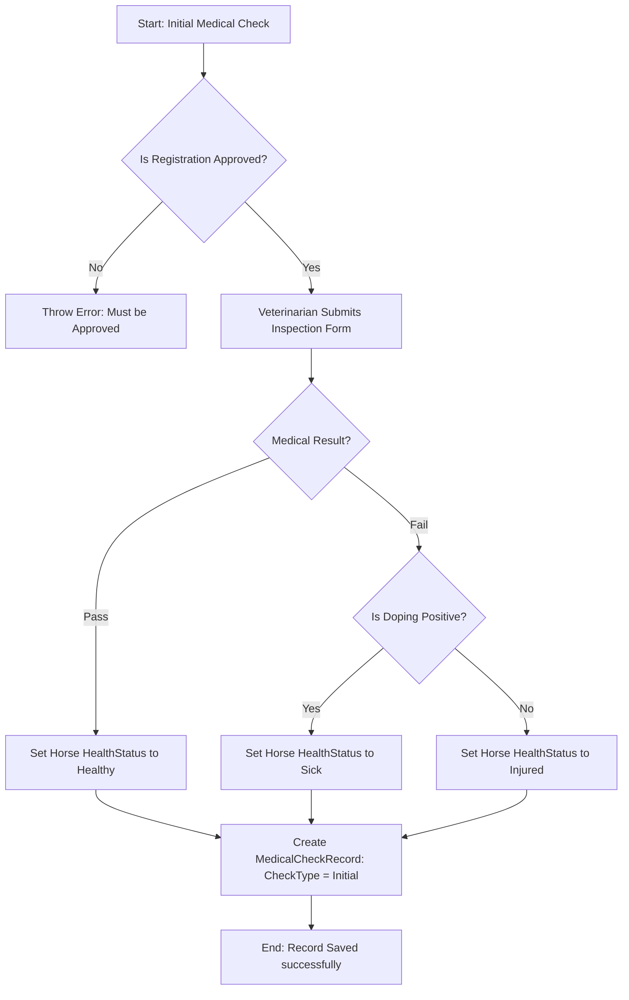
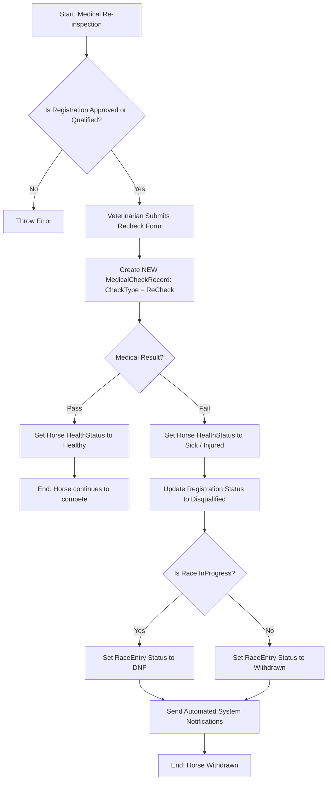

# Medical Inspection and Recheck Workflow

This document details the step-by-step logic, database updates, and workflow triggers that occur during the initial medical check and recheck processes of horses.

---

## 1. Initial Health Inspection (Awaiting Inspection)

The Initial Health Inspection is performed on horses that have newly registered for a tournament.

### Process Flow

### Details of Changes
1. **Validation Checks**:
   - The registration ID must exist.
   - The status of the registration in the database must be **`Approved`**.
   - Only one initial inspection record is allowed per registration.
2. **Database Record Creation**:
   - A new [MedicalCheckRecord](file:///d:/FPTUni/FU_SU2026/SWP391/HorseRacingManagementSystem/backend/src/HorseRacing.Domain/Entities/MedicalCheckRecord.cs) is added to the database with `CheckType = "Initial"`.
3. **Horse Health State Updates**:
   - **Passed (`MedicalResult == "Pass"`)**: Updates the `HealthStatus` of the `Horse` to **`Healthy`**.
   - **Failed (`MedicalResult == "Fail"`)**:
     - If `DopingResult == "Positive"`, `HealthStatus` is updated to **`Sick`**.
     - If `DopingResult == "Negative"`, `HealthStatus` is updated to **`Injured`**.

---

## 2. Medical Recheck Workflow (Race Scheduled)

The Re-inspection (Recheck) is performed on horses that have already been assigned to lanes in a scheduled race.

### Process Flow

### Details of Changes
1. **Validation Checks**:
   - The registration status must be **`Approved`** or **`Qualified`**.
2. **Database Record Creation**:
   - A new [MedicalCheckRecord](file:///d:/FPTUni/FU_SU2026/SWP391/HorseRacingManagementSystem/backend/src/HorseRacing.Domain/Entities/MedicalCheckRecord.cs) with `CheckType = "ReCheck"` is created. The previous initial check record is **never** overwritten to preserve inspection history.
3. **Outcome: Pass**:
   - Horse's `HealthStatus` is updated to **`Healthy`**. No further changes occur.
4. **Outcome: Fail (Disqualification & Withdrawal)**:
   - **Horse Health Status**: Updated to **`Sick`** (positive doping) or **`Injured`** (negative doping).
   - **Registration Status**: Updated to **`Disqualified`**.
   - **Race Entry Status**:
     - If the race has already started (`race.Status == "InProgress"`): The scheduled `RaceEntry.Status` changes to **`DNF`** (Did Not Finish).
     - If the race has not started: The `RaceEntry.Status` changes to **`Withdrawn`**.
     - `RaceEntry.WithdrawReason` is saved (e.g., `FailedMedicalReCheck`), and the `RaceEntry.WithdrawTime` is stamped with the current time.
5. **Notification Triggers**:
   - **Owner Notification**: Sent to the owner indicating the horse failed re-inspection and has been disqualified.
   - **Jockey Notification**: Sent to the jockey riding the horse, noting that the horse was withdrawn, which impacts their active ride contract.
   - **Referee Notification**: Sent to race referees updating them about the horse withdrawal.
   - **Bettor Notification**: Sent to users who bet on the horse, updating them about the withdrawal and advising them to review their bet slip status.

---

## 3. Laning & Competition Scheduling Flow

The timeline below details how the inspection status affects the tournament progression:

1. **Registration & Approval**: Owners register horses for the tournament. Registrations are checked and moved to **`Approved`**.
2. **Initial Inspections**: Bác sĩ (Veterinarians) inspect horses. Horses that pass are marked as **`Healthy`**.
3. **Closing Registration & Scheduling**:
   - The registration deadline is closed.
   - Admin clicks **Auto Assign Pre-lanes** in the Admin dashboard.
   - The system matches and schedules horses into lanes (creating `RaceEntry` records) for those with valid registration statuses.
4. **Recheck & Safety Inspection**:
   - Prior to the races, veterinarians can perform a **Recheck**.
   - If a horse is disqualified during the recheck, it is automatically withdrawn (`Withdrawn` or `DNF`), updating the respective race lists and notifying all stakeholders.
